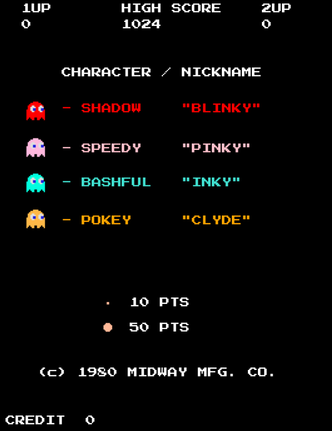
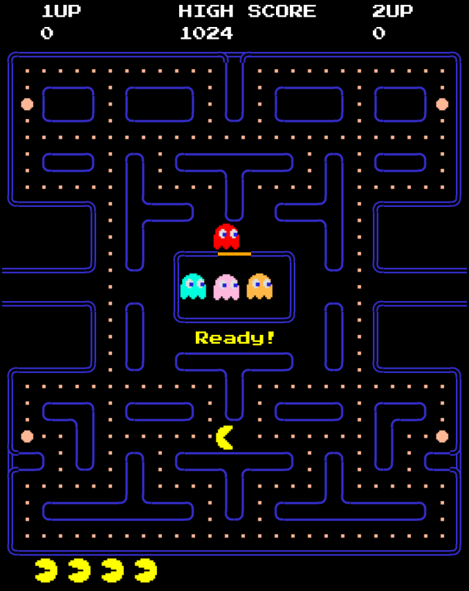
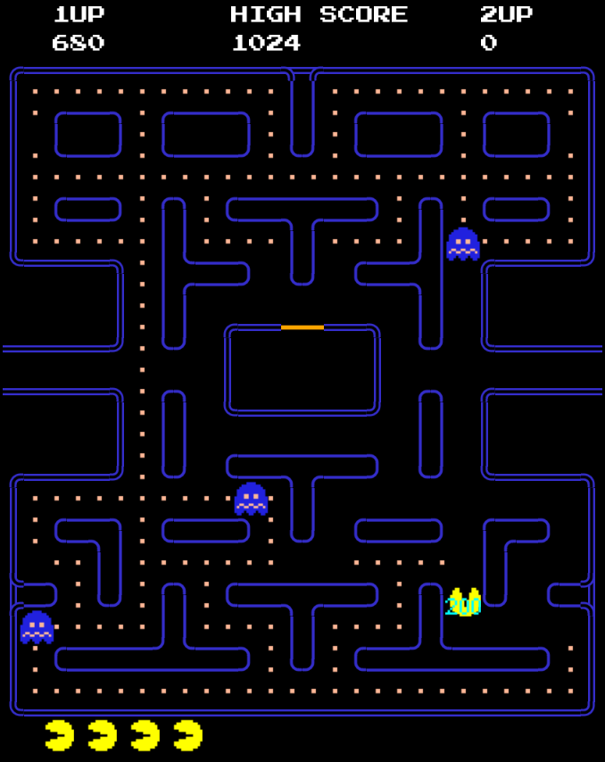

# My implementation of Pacman as a browser game

This is my attempt at an implementation of the famous computer game Pacman
(see: [Pacman at wikipedia.org](https://en.wikipedia.org/wiki/Pac-Man))
On YouTube I found a video that showed a gameplay of the original game.
I tried to get as close to the original as possible.

My Pacman version came about because I wanted to practice HTML5 and Javascript.
And the best way to do that is to programm a computer game.
That's exactly how I started learning to program as a teenager.
Back then - that was in the 1980s - I reprogrammed common games with a friend:
Snake, Frogger, Tetris, Space Invaders etc.
When I have time again, I'll program another one in Javascript. I have really enjoyed that. :-)

## Implementation

There are many other Pacman implementations on Github. This is great and shows that Pacman
can be easily reprogrammed. It is neither too simple nor too complex.
Pacman actually has everything a computer game needs: levels with increasing difficulty,
moving enemies, a clear gameplay.

This is my simple game flow:

| state           | event               | action               | next state |
| --------------- | ------------------- | -------------------- | ---------- |
| INIT            | keypressed          | level = 0, lives = 5 | READY     |
| READY           | 5 secs              |                      | RUNNING   |
| RUNNING         | all foods eaten     |                      | WON       |
| RUNNING         | ghost collision     |                      | LOST      |
| WON             |                     | inc level            | READY     |
| LOST            | lives > 0           | dec lives            | READY     |
| LOST            | lives == 0          |                      | OVER      |
| OVER            | keypressed          |                      | INIT      |

## Screenshots
Here you can see some screenshots of my Pacman version.

<figure>
    
    <figcaption>The Pacman intro page.</figcaption>
</figure>

*The Pacman intro page*

*Pacman is ready to play*

*Pacman eats a ghost*

## Usage
Run the game: clone the repository and load the file 'index.html' into
the browser.

## Information
Sound Effect from <a href="https://pixabay.com/?utm_source=link-attribution&utm_medium=referral&utm_campaign=music&utm_content=6783">Pixabay</a>
